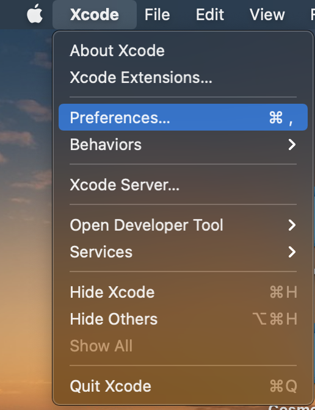
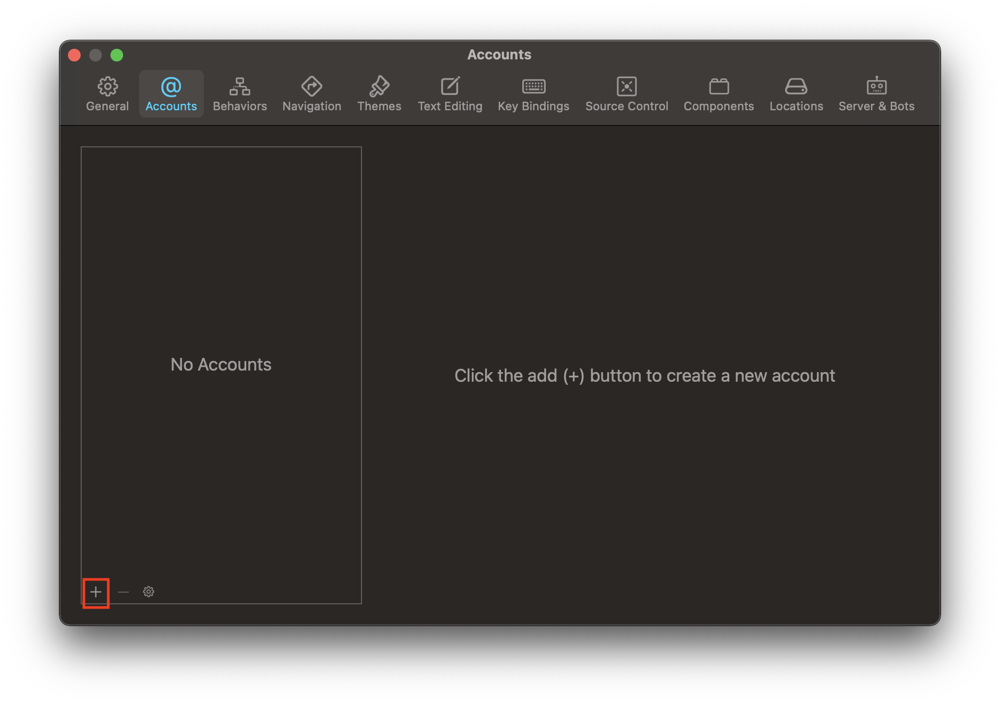
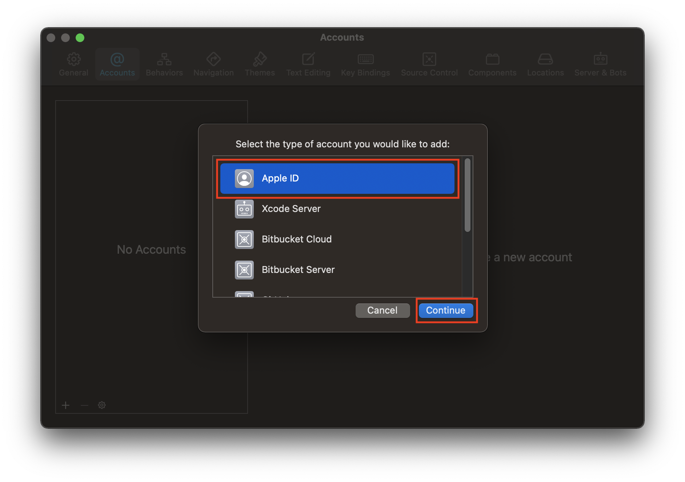
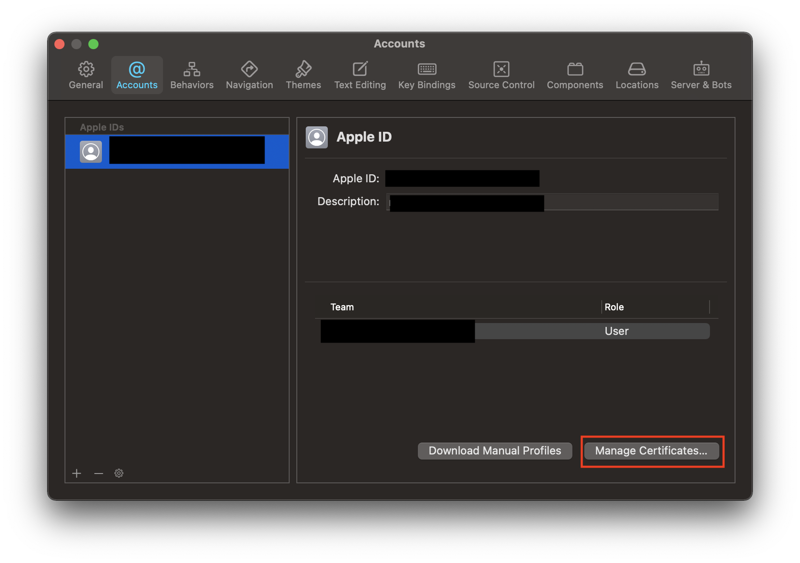
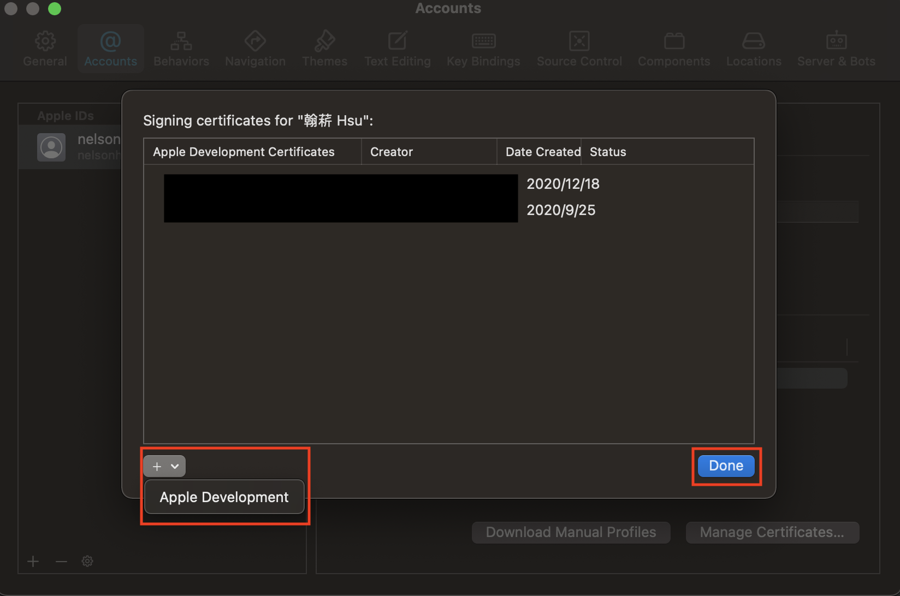

## 建立免費開發者證書

1. 開啟 Xcode ，點擊工具列「Xcode」>「Preferences…」  

2. 點「Accounts」選單，點擊左下角「+」來新增 Apple ID 帳號

3. 選擇「Apple ID」> 按下「Continue」

4. 跳出要登入 Apple ID 帳密視窗，輸入完成後點擊「Next」

5. 確認 Apple IDs 清單內有出現剛登入的 Apple ID 帳號後，點擊右下角「Manage Certificates…」

6. 點選「+」>「Apple Development」來建立 iOS 開發者證書，最後點擊「Done」關閉
