## 安裝Hybrid App 解說文件
### 目錄
- [iOS](#iOS)
- [Android](#Android)

### iOS
- 備註: 只有MacOS才可開發
- 使用工具: [Xcode](https://apps.apple.com/tw/app/xcode/id497799835?mt=12)
- 說明:
    1. 執行`./RunScript/build_ios.sh`後，於`Frontend`資料夾下會產出`ios`專案
    2. 執行上方指令後，系統會自動開啟Xcode，將此`ios`專案打開，此專案即為使用Vue寫好的Hybrid App  
    若專案沒有自動打開，請手動開啟Xcode，import `ios`整個資料夾
    3. 第一次使用Xcode，可能會遇以下狀況，請按照終端機回應的連結，進入去安裝其需要的套件。
    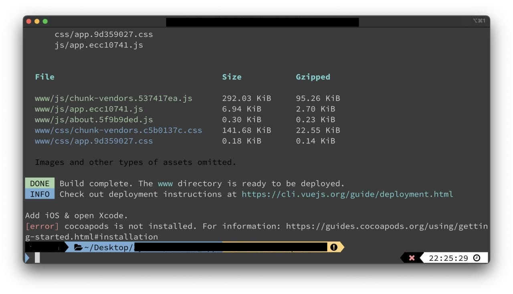  
      
    也可直接執行以下兩個執指令:  
    <!-- 參考網站 : https://ephrain.net/cordova-編譯-ios-出現-xcodebuild-requires-xcode-的錯誤訊息/ -->
    ```bash
        # 安裝cocoapods
        ＄sudo gem install cocoapods https://guides.cocoapods.org/using/getting-started.html#installation

        # 在路徑下設置完整個Xcode
        ＄sudo xcode-select -s /Applications/Xcode.app/Contents/Developer
    ```
    4. Run App on Phone or Simulator
        1. 首次看到畫面如下:  
        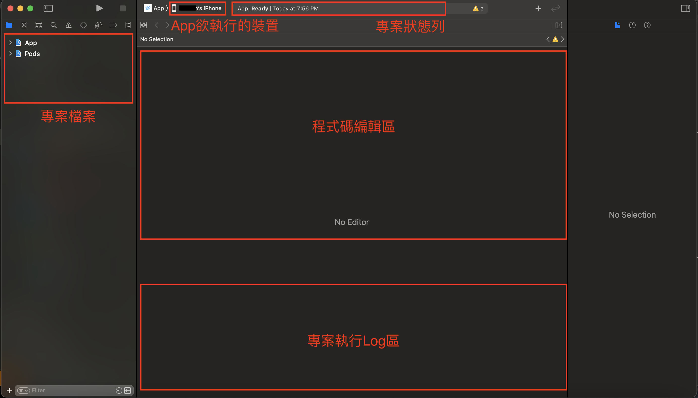
        2. `Signing`，開發Apple相關軟體時，必需要註冊此產品是誰製作的，若出事時，才能追究，因此需登入開發者的AppleID，方可繼續往後執行。  
        此畫面在安裝App於實體機時才會出現，若只在Xcode提供的模擬機運行，並無需理會以下步驟。直接按下`執行鈕`，即可運行。  
        [建立免費開發者教學](./FreeiOSDevelopor.md)   
        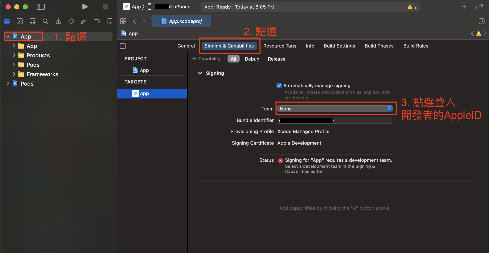
        3. 若註冊成功，下方`Signing Certificate`原為紅色警告，應消失，呈現的是開發者的AppleID  
        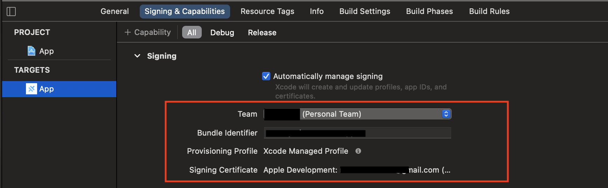
        4. 選取欲安裝的裝置(於Xcode上方的`App欲執行的裝置`)  
        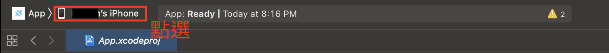
        5. 點選`執行鈕`  
        
        6. 專案第一次安裝到實體機時，會遇驗證問題，因此還無法執行成功
            1. 報錯畫面  
            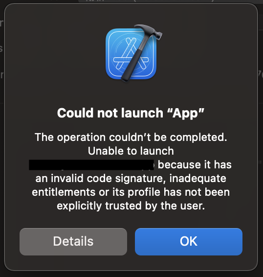
            2. 回到實體機驗證。點選「設定」>「一般」>「裝置管理」>點選「開發者APP」  
            
            3. 點選「信任「Apple Development:...」」  
            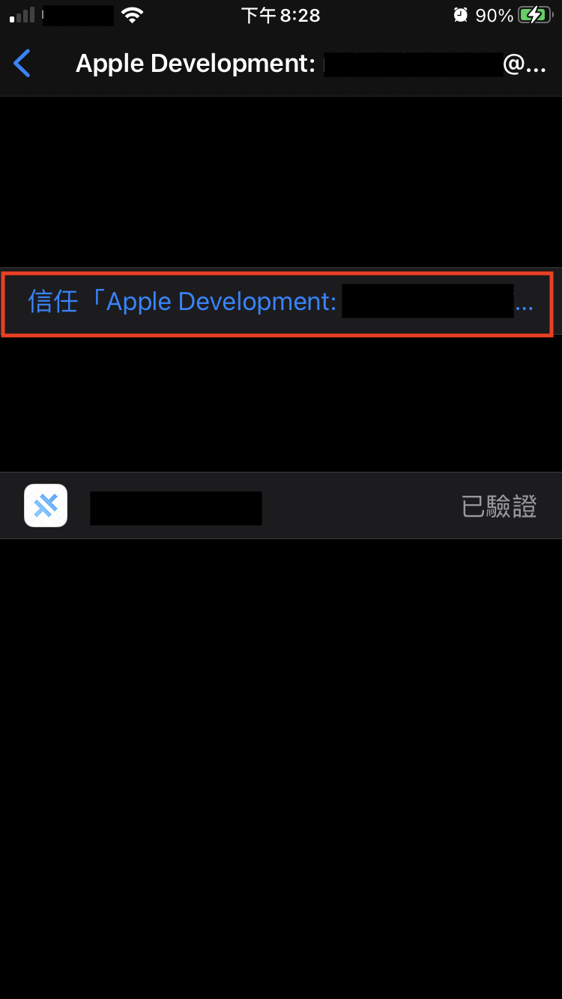
            4. 完成上述步驟，再回到Xcode，重新按下`執行鈕`，即可在實體機上看到軟體執行
        7. 補充:*NSBluetoothAlwaysUsageDescription*問題
            - iOS於13版本以後，會要求開發者的軟體若有使用到藍芽功能，必需徵求使用者使用藍芽的權限。若沒有設置的話，軟體會無法運行。  
            以往使用Cordova，可直接將設定寫於`config.xml`中，於輸出時，會自動將*NSBluetoothAlwaysUsageDescription*配置。  
            但使用Capacitor後，其主導權歸還給Xcode，因此需於Xcode進行配置。
            - 配置步驟如下 
                1. 選擇Info.plist
                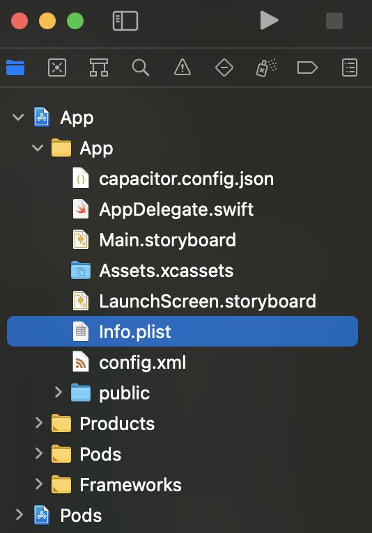
                2. 於`Key`欄位找到`Privacy`開頭，在該列會看到`加號`，點選以新增新一列
                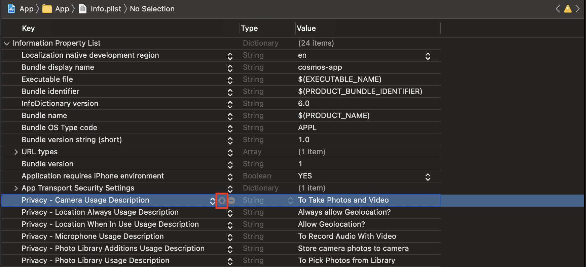
                3. 輸入欄輸入「Privacy - Bluetooth Always Usage Description」
                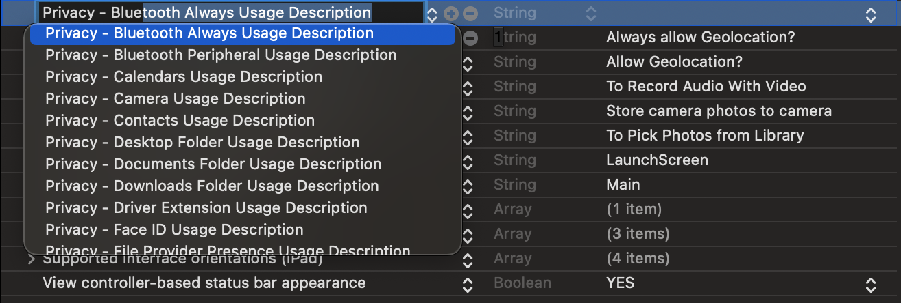
                4. `Value`欄位輸入「This app will use your bluetooth」或其他描述
                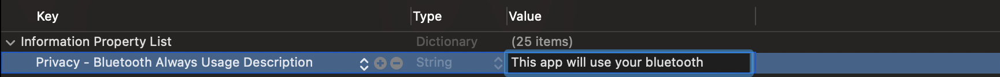
                5. 設置完畢後，即可重新安裝軟體至手機執行


### Android
- 備註: Windows、MacOS、Linux皆可開發
- 使用工具: [Android Studio](https://developer.android.com/studio?gclid=Cj0KCQiA2af-BRDzARIsAIVQUOedTI5TUzMDw_BaXDt-S53X17me-GcnAyXjBXUmqjHSxMyhE-YGc4waApFOEALw_wcB&gclsrc=aw.ds#downloads)
- 說明:
    1. 執行`./RunScript/build_android.sh`後，於`Frontend`資料夾下會產出`android`專案
    2. 執行上方指令後，系統會自動開啟[Adroid Studio，將此`android`專案打開，此專案即為使用Vue寫好的Hybrid App  
    若專案沒有自動打開，請手動開啟Android Studio，import `android`整個資料夾
    3. Run App on Phone or Simulator
        1. 首次看到畫面如下:  
        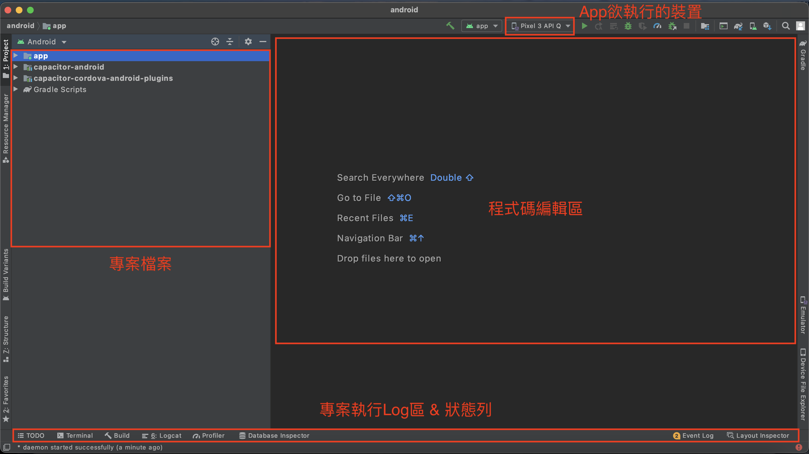
        2. 打開Android手機上開發人員配置：「設定」 > 「系統」 > 「關於手機」 > 「軟體資訊」 > 「更多」 > 「版本號碼」  
        然後對著「版本號碼」快速點按5次上，系統會通知你剩下幾個步驟，就可以成為開發人員，完成以上步驟，即可開啟開發人員功能
        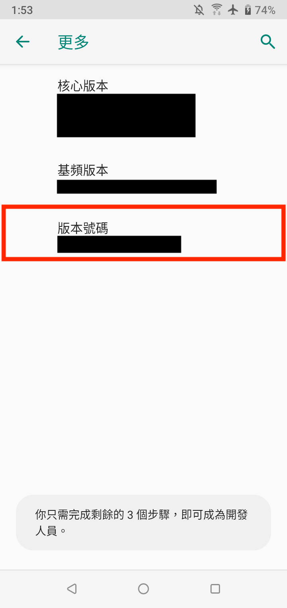
        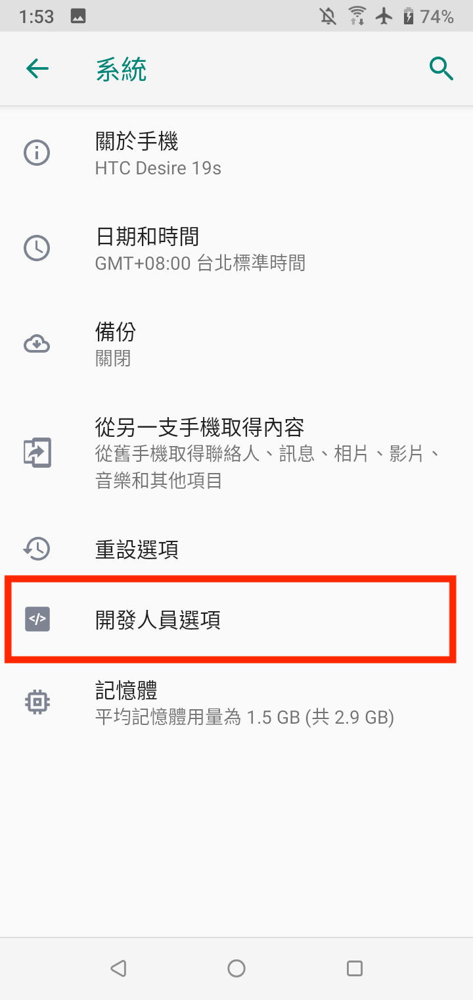
        3. 打開「USB偵錯」  
        點選「設定」> 「系統」 > 「開發人員選項」 > 「偵錯」 > 打開「USB偵錯」 > 確認打開
        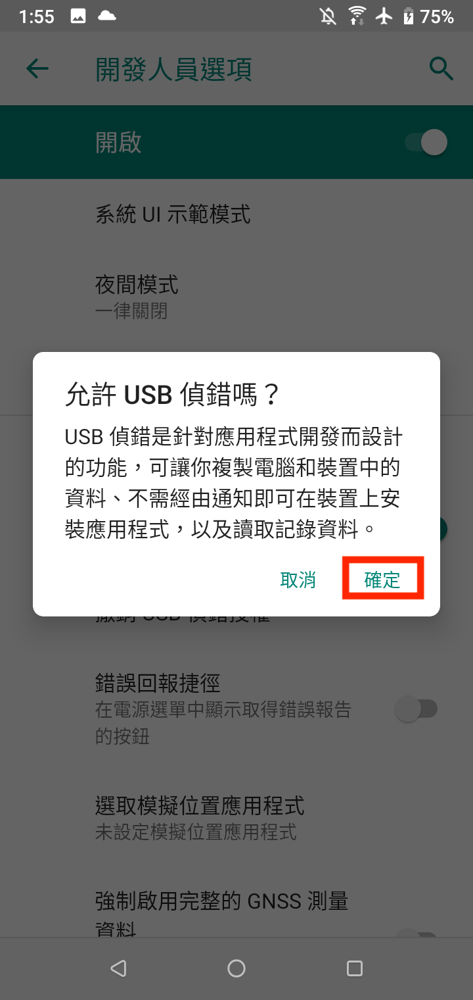
        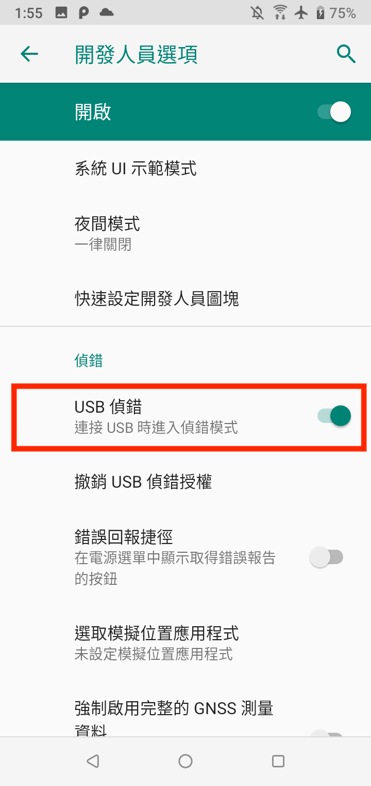  
        4. 手機接上電腦，拉下手機的通知欄，確認其USB偵錯是否如下圖，已為打開狀態
        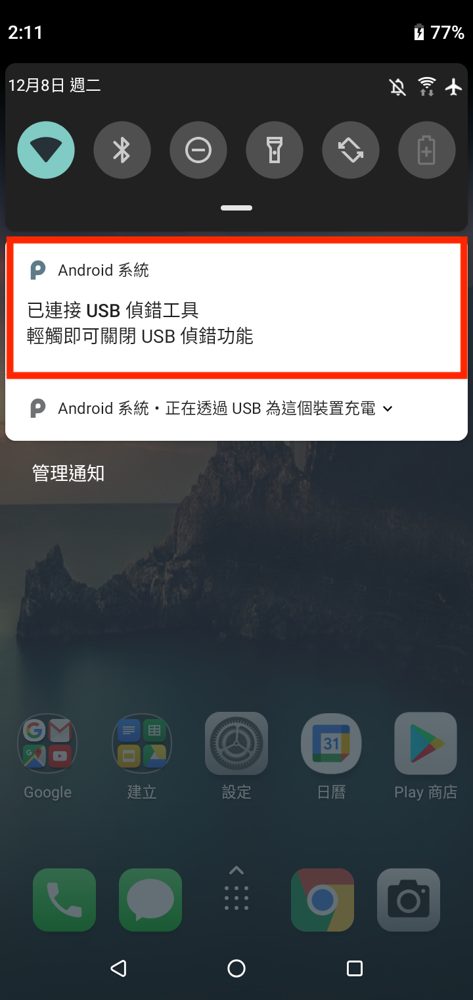
        5. 選取欲安裝的裝置(於Android Studio上方的`App欲執行的裝置`)  
        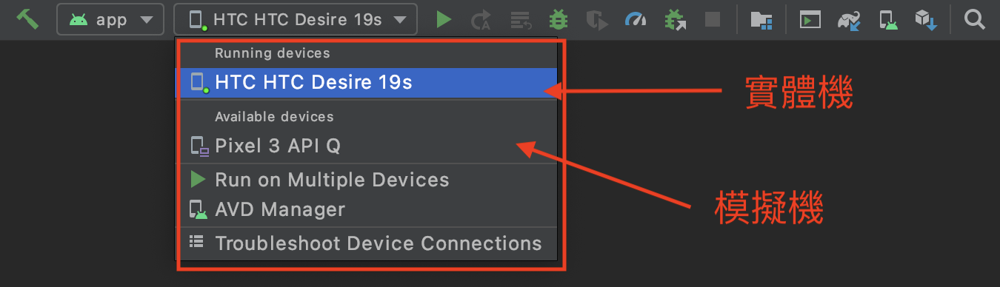
        6. 點選`執行鈕`  
        P.S.若執行鈕無法點選，可能是專案import的工作還未結束，需等系統一些時間。  
        若無法選取實體機，可能是上述步驟有遺漏或是手機沒有正常接上電腦，可試著換一條連接線試試看。